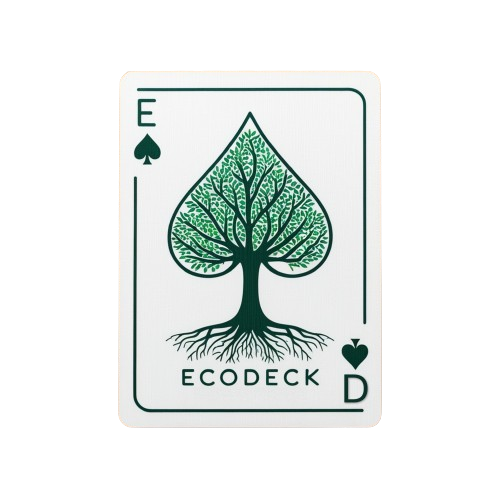

# EcoDeck - O Jogo da Sustentabilidade

## Visão Geral

O **EcoCDeck** é um jogo interativo e educativo que combina cartas dinâmicas e um tabuleiro físico para testar e expandir o conhecimento dos jogadores sobre sustentabilidade. Os jogadores enfrentam desafios, tomam decisões que impactam o meio ambiente e avançam no tabuleiro à medida que progridem no jogo.

## Recursos Principais

- **Cartas Dinâmicas:** O jogo inclui perguntas, desafios de múltipla escolha e tarefas em ordem para envolver os jogadores.
- **Tabuleiro Físico:** O jogo pode ser jogado com um tabuleiro impresso, onde os jogadores avançam conforme suas decisões e desempenho nas cartas.
- **Progressão:** O progresso dos jogadores é monitorado através de contadores de acertos, erros e barras completadas.
- **Dicas e Fontes:** Os jogadores podem acessar dicas e fontes de informação para promover aprendizado contínuo.
- **Personalização:** O jogo permite a seleção de categorias de interesse, proporcionando uma experiência personalizada.

## Tecnologias Utilizadas

- **React.js:** Biblioteca JavaScript para construção de interfaces de usuário.
- **Next.js:** Framework React para renderização do lado do servidor e geração de sites estáticos.
- **TypeScript:** Linguagem de programação que adiciona tipos ao JavaScript, melhorando a robustez do código.
- **Lucide-React:** Conjunto de ícones para melhorar a interface visual.
- **React-Medium-Image-Zoom:** Biblioteca para zoom em imagens.
- **Editor de Slider:** Um editor de slider foi incorporado ao jogo para facilitar ajustes dinâmicos na interface do usuário.
- **Impressão de Tabuleiro:** O tabuleiro do jogo pode ser impresso, permitindo uma experiência de jogo físico em combinação com a interação digital.

## Licença e Contribuição

O **EcoDeck** é um jogo de código aberto, disponível para ser modificado e adaptado conforme as suas necessidades. Você é livre para fazer *fork* ou *clone* deste repositório, uma vez que ele está licenciado sob a licença **MIT**, que permite a edição e modificação do código.

## Contato

Para mais informações, entre em contato através de:
- **Email:** seuemail@example.com
- **LinkedIn:** [SeuNome](https://www.linkedin.com/in/seunome/)

---

**Divirta-se aprendendo com o EcoChallenge e faça parte da mudança para um mundo mais sustentável!**
